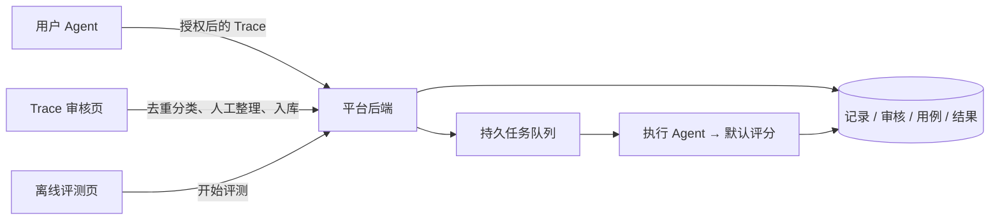

# Trace 审核与离线评测 · 简化架构

状态：目标设计，更新于 2026-08-31，与 [PRD v0.7](../prd/eval-platform-closed-loop.md)、[交互说明](../prd/eval-platform-interaction-design.md)、[环境制作设计](../prd/eval-environment-authoring.md) 及 [研究依据](../prd/eval-platform-research.md) 配套。v0.7 补充环境制作原型；本文中的新增接口并非已落地能力。

## 1. 先讲清楚数据去哪里

两个页面共用同一后端：「离线评测」选择集合并启动、查看结果；「Trace 审核」接收用户 Agent 上传的授权脱敏记录，折叠重复、分类、人工审核后入库。开始审核只改变状态，不再上传到另一个审核系统。



保持 Next + TypeScript 的页面/API，PostgreSQL / Drizzle 存储，pg-boss 队列与独立 Node Worker。Worker 可以复用 Next 后端所在项目的业务代码，但不依赖 HTTP 请求生命周期。逻辑分层不要求拆出新服务。

## 2. 当前需要的职责

| 职责                  | 处理什么                                                 | 不处理什么                               |
| --------------------- | -------------------------------------------------------- | ---------------------------------------- |
| TraceStore / 接收服务 | 鉴权接收、上传去重、证据相同分组、分类、持久化和受控读取 | 自动归因、自动转成用例                   |
| ReviewService         | 审核状态、人工改写草稿、入库检查和本地集合发布事务       | 执行用户代码、按分数推断根因             |
| DatasetPort           | 查询目录、读取统一用例和不可变版本                       | 评分算法、模型调用、强制向外部只读集写入 |
| GradingPort           | 根据用例期望和本次执行证据给出结果                       | 重跑用户环境、修改项目                   |

执行层复用已有 Agent Runtime 与评测编排，读取统一用例，产出独立的执行证据。Runtime 的用户任务完成检查与写回安全策略仍保留；它们不是平台离线评分。

建议保留在现有 monorepo 内：平台的接收/审核/API/持久化在 apps/eval-platform；统一用例、执行编排与评分接口在 packages/eval-engine；Agent 与 telemetry 不依赖评测平台 UI。不要为四个接口再拆四个包。

## 3. 替换能力只保留在接口与装配处

以下为边界示意，不要求重新实现已有等价接口：

```ts
interface DatasetPort {
  listAvailable(): Promise<DatasetSummary[]>
  getVersion(ref: DatasetRef): Promise<DatasetSnapshot>
}

interface GradingPort {
  readonly identity: { id: string; version: string; digest: string }
  grade(input: {
    caseSnapshot: EvalCaseSnapshot
    executionEvidence: ExecutionEvidence
    signal: AbortSignal
  }): Promise<GradeResult>
}

interface CriterionResult {
  criterionId: string
  required: boolean
  status: 'pass' | 'fail' | 'unknown' | 'error'
  method: 'program' | 'model'
  reason: string
  evidenceRefs: EvidenceRef[]
}

type GradeResult = {
  checks: CriterionResult[]
  // 保留第三方原始指标及口径；不能映射时不得自造通过阈值。
  rawMetrics?: { name: string; value: number; unit?: string; definitionRef: string }[]
} & (
  | { status: 'scored'; passed: boolean; reason: string }
  | { status: 'insufficient_evidence'; reason: string }
  | { status: 'error'; reason: string; retryable: boolean }
)

const evaluation = new EvaluationService({
  datasets: reviewedDatasetStore,
  executor: existingAgentExecutor,
  grader: defaultGradingAdapter,
})
```

本版只装配一个默认评分适配器。内部可以调用现有程序检查与默认 AI 评审；后者的模型、rubric 和输出校验由服务端配置并版本化。以后接第三方评分器时替换适配器；读第三方评测集时增加数据源适配，不改页面或 Agent Loop。支持新格式仍需开发适配代码，不承诺任意格式自动兼容。

前端从目录选择评测集，再调用「开始评测」，读取配置摘要和统一结果；不出现 grader 插件 ID 或配置 schema 表单。不需要先建设注册中心、动态插件加载或评分器市场。目录区分只读外部集与可写人工集，发布命令携带目标集合，创建新集合校验名称与权限。

发布由 ReviewService 与本地存储完成事务，不要求外部 DatasetPort 实现写入。目录返回执行/评分能力检查结果，不可运行的集合说明原因。外部官方验证器未来经受控适配器接入，不能把「成功导入题目」等同于「能给出官方成绩」。

必选判据来自已发布的用例/集合契约，并与默认评分配置一起冻结。聚合器先验证 criterionId、完整性和证据引用：所有必选项通过才通过；已证实的必选失败足以判失败，同时保留其他项的缺失；没有明确失败但必选项未完整判定则未判定。可选建议和用量不参与抵消。没有任何可执行验收条件时禁止发布，不能让空数组全通过。

required 与 method 只回显服务端已固定配置，不能由评分模型自行修改；最终 passed 由可信聚合器计算并校验。证据引用属于同一执行且存在只是必要条件，不保证 AI 的解释正确；人工意见保留这层不确定性。

执行错误与判据结果分开：平台故障默认无法判定；有真实证据且任务事先要求的预算、格式或行为约束可正常判失败。不能仅凭错误类型就猜测责任模块，也不能把所有 tool error 当成任务失败。

## 4. 最少保留的数据

| 数据             | 核心字段与含义                                                                                                             |
| ---------------- | -------------------------------------------------------------------------------------------------------------------------- |
| UploadedTrace    | id、uploadId、授权范围、所属主体、接收时间、内容摘要、任务边界/必要前置上下文、原始任务/输出/工具记录、缺失/脱敏标记       |
| ReviewRecord     | traceId、审核人、决定与原因、修订号、时间；保留历史，不覆盖原始记录                                                        |
| TraceGroup       | groupId、所属主体、比较策略版本、完整证据/任务条件指纹、成员 Trace 引用、人工分类、审核状态；不删除成员                    |
| CaseDraft        | 标题、人工重写 input、验收条件列表、独立上下文或 fixtureRef、任务覆盖范围、来源关联、隐私/用途审核及检查报告；草稿不可执行 |
| DatasetVersion   | 数据集 ID、不可变版本、用例快照及摘要；入库自动产生新版本                                                                  |
| EvalRun          | 数据集/验收版本、Agent 构建、模型/Prompt/工具/环境配置摘要、grader 版本、预算、状态、幂等键；默认每题一次                  |
| CaseTrial        | caseVersionId、trialId、初始上下文/环境摘要、executionId、终止状态；不同重跑保留不同尝试，不选最好一次覆盖                 |
| CaseResult       | trialId、scoreAttemptId、grader 版本、逐项结果/理由/证据引用、原始指标；一次执行可以有多个评分版本                         |
| ReviewAnnotation | 精确的 scoreAttemptId、作者、异议/核对决定、理由、时间和证据引用；追加写入，与机器原结果并列                               |
| CaseSourceLink   | caseVersionId、sourceTraceId/范围、来源用途与授权引用；多对多，后到来源不修改已冻结的用例正文                              |

原始 Trace、改写用例和新执行证据必须是三份不同的数据，不能互相覆盖。保存实际提供给模型的可授权请求内容及工具声明，用于查证；不可获得的内部推理不在采集范围。密钥不能进入 Trace，缺失用量不能填成零。

证据事件以 executionId、eventId、parentEventId、actorId、调用 ID 和局部序号关联，记录开始/结束、状态及有权限读取的制品引用。模型事件关联实际 messages、当次工具声明、有效 Prompt 快照/来源和响应；工具事件关联参数/输出；验证事件关联测试、diff 或状态快照；评分事件关联评审输入/输出。全局时间只用于展示，不替代并行及子 Agent 的父子关系。

聚合用量按唯一模型调用计数，分开被测 Agent/子 Agent 和评分模型；流式增量与最终累计值规范化后只能计一次。未知用量、供应商不同的缓存计费字段以及估算价格版本保留语义，不用零或随意加总代替。

入库的代码 fixture 来自受控目录，固定摘要，必须能独立准备并通过兼容性检查；不能把用户项目路径当 fixture。纯文本任务不强制 Docker。机器检查与人工确认配合，无法保证用户代码匿名化时不允许直接复用。

用例的 Agent 输入与验收区隔离：Agent 看到任务要求，但看不到参考答案、隐藏测试实现或评分提示词。新程序验证器需已知正确/错误制品自检，复用已校验模板可免重复配置；文本判据由人工确认清晰，并限制在默认 judge 已校准的适用域。材料检查不默认调用模型，付费试运行必须独立确认。Trace 中带入的新领域判据不能直接视为已校准。

## 5. 核心接口与流程

接口名称为建议，最终可适配现有路由：

| API                                  | 行为                                                           |
| ------------------------------------ | -------------------------------------------------------------- |
| POST /api/traces                     | 鉴权、限制大小、验证授权/格式与脱敏策略、幂等保存后返回记录 ID |
| GET /api/traces、GET /api/traces/:id | 分页列表、经权限校验的详情                                     |
| POST /api/trace-groups/:id/review    | 开始或恢复同组人工审核，不复制上传                             |
| PUT /api/reviews/:id/draft           | 保存改写稿，修订号检查并发冲突                                 |
| POST /api/reviews/:id/skip           | 保存暂不采用原因                                               |
| POST /api/reviews/:id/publish        | 验证独立性/用途/材料，事务提交审核、用例与新版本               |
| GET /api/datasets                    | 返回当前主体可用的集合、版本、用例数与是否允许写入             |
| POST /api/datasets                   | 创建人工集合，或在发布事务中按名称创建                         |
| PATCH /api/trace-groups/:id          | 人工修改分类，修订号检查；分类不推断根因                       |
| POST /api/eval-runs                  | 校验默认配置与预算，冻结版本，事务创建运行和持久任务           |
| GET /api/eval-runs/:id               | 返回状态与逐用例结果；取消使用独立命令接口                     |
| GET /api/eval-runs/:id/cases/:caseId | 返回各次执行/评分及可展开的事件；分页与权限检查                |
| POST /api/score-attempts/:id/reviews | 添加评分异议或人工核对意见，不覆盖原始评分                     |

Worker：领取任务 → 准备独立环境 → 执行被测 Agent → 固化证据 → 默认评分器 → 保存结果 → 释放环境。需要环境的验证在环境释放前完成并固化结果；评分读取已保存证据，不假设还能访问已销毁的工作区。

每个 Trial 重置工作区、会话、记忆和与结果相关的缓存；需要测试记忆时由 fixture 显式准备。Agent 无权修改可信验证器和标准答案。执行版本、Task 输入和 grader 分别固定；评分重试使用相同执行证据，Agent 重跑创建新 Trial，不共用「retry」一词掩盖区别。P0 只实现正常单次执行与有界故障重试，批量重跑/重评分 UI 留 P1。

上传成功只表示记录已保存；人工同意入库才生成独立用例；运行完成只表示流程终止；评分不通过才是对本次表现的判断。不要把这些状态混在一起。

详情接口提供分页的逐用例结果与按需加载的链路，不把所有模型原文塞进运行列表。结果聚合使用同一运行快照：总数 = 通过 + 不通过 + 未判定 + 未完成；取消保留部分结果。评分原因引用同一 executionId 内的事件，服务端验证引用存在。通过也要返回原因；错误不能伪装成不通过。历史运行与 datasetVersion 明确关联。

这里的状态数量按当前运行每题的固定尝试口径计数，评分重试不增加任务总数。历史评分不删除；P0 人工异议仅作为并列意见和异议数量，不修改机器汇总。未来引入人工覆盖或重复试验时必须显式定义并版本化汇总口径，不静默挑最高分。

评分仅对声明为可重试的故障执行有界重试，采用第一个结构有效且证据引用合法的结果；不对一个有效的「不通过」自动重评。保留所有 scoreAttempt 与费用，重试耗尽则未判定。Agent 整体重启不得悄悄替换该次 Trial，P0 手动再次启动产生新运行；不能把最好一次当原始单次表现。

去重分两层：uploadId 防止同次上传重试重复保存；同一主体、同一任务条件内对完整且可比较的上下文/模型/Prompt/工具/初始环境和结果做版本化规范序列化指纹，再核验内容一致，形成 TraceGroup。缺少必要环境或上下文无法证明相同、脱敏过度、截断或只有语义相似时不自动合并。分组是展示与审核单位，分类与根因无关；成员来源及授权分别保存。

默认一次审核发布一个候选；幂等键和修订号约束该发布操作，不在 TraceGroup 上建立永久一对一 case 唯一约束。CaseSourceLink 支持未来拆分与多来源，但首版不展示复杂拆分界面。新增重复成员仅追加来源关联，不更改已发布用例版本和历史执行快照，且独立检查授权。

## 6. 简化界面不省掉后端保障

- 服务端身份认证、资源归属与访问隔离；上传者同意上传不代表同意入库、跨项目共享或训练。
- 原始数据受保留期限与删除策略约束；删除/撤销时处理关联的草稿、制品和用例，阻断被撤销材料的新运行。
- 同一 uploadId 相同摘要幂等返回，不同摘要冲突；发布与创建运行也要幂等，防止重复入库/计费。
- Worker 使用持久任务和状态条件更新；重试保存 attempt。调用已发出但响应丢失时不承诺恰好计费一次，限制重试并保留不确定状态。
- 默认模型不可用、评分输出不合法、证据不足分别展示错误，不记为质量 0 分。AI 评分的证据引用必须校验存在，避免编造引用。
- 取消停止新的工作，尽力中止进行中的调用，保留已花费用与部分结果，不把取消当通过。
- 前端展示的 Trace 为不可信文本，禁止执行其中内容；AI 评审也要隔离任务文本与评分指令，限制工具权限并校验结构化输出。
- 默认 judge 版本发布前用人工标注的通过/失败/不足证据样本检查一致性、误判和漏判；语义判断不能只靠模型自报置信度。保留人工意见和评分原始证据以便校准，不建新标注服务。抽查不只看失败样本。
- 入库检查、评分与审核的授权用途分别验证；不能因一个组成员获准复用而默认其他成员也获准，不能将用户数据用于训练。

## 7. 实施顺序

1. **离线最小链路**：统一判据/结果/证据引用，复用现有 Worker 与执行器，做到选集、执行、真实验证、总览和证据下钻。
2. **来源到用例**：补齐接收接口、保守去重与分类，同页连续审核、草稿、检查及目标集合发布事务。
3. **默认 AI 评审与闭环验收**：在确定性验证之外补语义判据，校准默认 judge，增加最小异议记录，并按 PRD 做端到端异常验收。

不在这版实现自动根因、评分器管理、自动优化与发布闭环。保留版本和实际证据，后续调查才有依据；不提前声称能准确定位某个模块。
